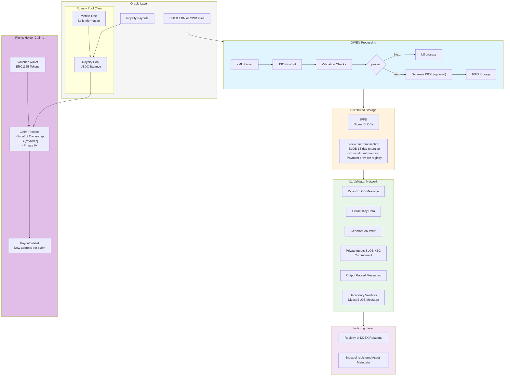

```mermaid
flowchart TB
    subgraph Oracle["Oracle Layer"]
        input1["DDEX.ERN or CWR Files"]
        input3["Royalty Payouts"]
        
        subgraph RoyaltyClient["Royalty Pool Client"]
            merkle["Merkle Tree\nSplit Information"]
            pool["Royalty Pool\nUSDC Balance"]
        end

        input3 --> pool
    end

    subgraph OWEN["OWEN Processing"]
        parse["XML Parser"]
        convert["JSON output"]
        check["Validation Checks"]
        passed{"passed"}
        kill["kill process"]
        generate["Generate ISCC (optional)"]
        ipfs["IPFS Storage"]
    
        parse --> convert
        convert --> check
        check --> passed
        passed -->|No| kill
        passed -->|Yes| generate
        generate --> ipfs
    end

    subgraph Storage["Distributed Storage"]
        ipfsStore["IPFS\nStores BLOBs"]
        blobContract["Blockchain Transaction\n- BLOB 18-day retention\n- Commitment mapping\n- Payment provider registry"]
    end

    subgraph ValidatorNetwork["L1 Validator Network"]
        digest1["Digest BLOB Message"]
        extract["Extract Key Data"]
        zkproof["Generate ZK Proof"]
        commit["Private Inputs BLOB KZG\nCommitment"]
        output["Output Parsed Messages"]
        digest2["Secondary Validator\nDigest BLOB Message"]
    end

    subgraph Index["Indexing Layer"]
        registry["Registry of DDEX Relations"]
        metadata["Index of registered Asset Metadata"]
    end

    subgraph RightsClaims["Rights Holder Claims"]
        voucher["Voucher Wallet\nERC1155 Tokens"]
        claim["Claim Process\n- Proof of Ownership\n- Σ[royalties]\n- Private 0x"]
        payout["Payout Wallet\nNew address per claim"]
    end

    input1 --> OWEN
    OWEN --> Storage
    Storage --> ValidatorNetwork
    ValidatorNetwork --> Index
    
    merkle --> pool
    pool --> claim
    voucher --> claim
    claim --> payout
    
    style Oracle fill:#f5f5f5
    style OWEN fill:#e1f5fe
    style Storage fill:#fff3e0
    style ValidatorNetwork fill:#e8f5e9
    style Index fill:#f3e5f5
    style RightsClaims fill:#e1bee7
```
